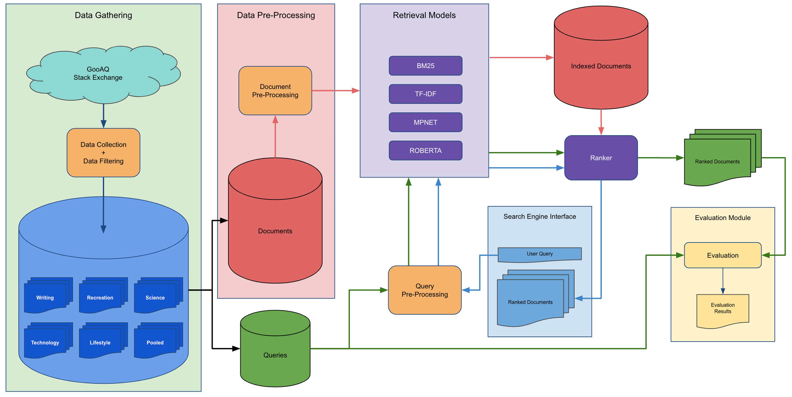
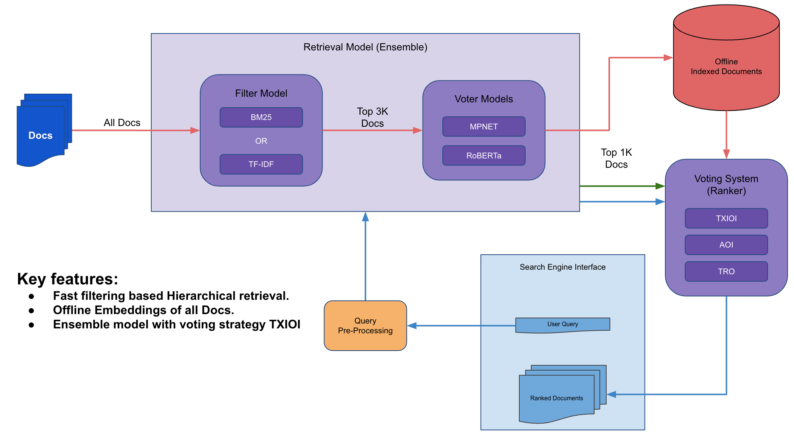

# TF4ces Search Engine

An experiment driven Search Engine Project, developed to index and retrive best documents given a query using ensemble of models. 

## Architecture Diagram
### System Design : Search Engine

### System Design : Ensemble Model


## Retirval Models
  - Filter Modelss
      - BM25
      - TF-IDF
 - Voter Models
     - MPNET
     - RoBERTa
  
 
## Project Plan

 - [X] Phase 1
      - [X] Data Analysis & Pipeline
      - [X] Model Pipeline
      - [X] Evaluation Pipeline
 - [X] Phase 2
      - [X] BM25 Model + MPNet Model
      - [X] Hyperparameter tuning
      - [X] Ensemble Pipeline
 - [X] Phase 3
      - [X] RoBERTa Model
      - [X] Ensemble enhancement
      - [X] Experimentation
  
  
## Future works

 - [ ] Finetune ColBERT
 - [ ] Implement Clustering of docs

## How to run Project

1. Clone repository
    ```console
    $ git clone https://github.com/TF4ces/TF4ces-search-engine.git
    ```
    
2. Setup Environment repository
    ```console
    $ python3 -m venv venv
    $ source venv/bin/activate
    $ pip -r requirements.txt
    ```
    
3. Download pre-loaded embeddings to this path: `./dataset/embeddings_test` from [GDrive](https://drive.google.com/file/d/1x-lOZMwBK5Ea9eCDE18gQCTnukZ16xQT/view?usp=share_link)
   
   **Note**: To generate embeddings from scratch run[./tests/test_evaluate_model.py](tests/test_evaluate_model.py) script setting MODEL to `all-mpnet-base-v2`, `all-roberta-large-v1` individually twice. 
   
   **WARNING**: use a GPU machine and it is expected to take 1hr to generate.


3. Run TF4ces Search Engine
      
   1. Run Eval Pipeline from [this](./tests/notebooks/TF4ces_Search_Eval.ipynb) ipynb notebook.
   2. Run prediction Demo Pipeline from [this](./tests/notebooks/TF4ces_Search_Demo.ipynb) ipynb notebook.

   
## Contributors

- [Mohammed Ataaur Rahaman](https://github.com/ataago)
- [Edmund Lepre](https://github.com/edmundlepre)
- [Arvind Jadhav](https://github.com/Arvind-AI-7)
- [Ayushi Choudhury](https://github.com/Ayushi231)
